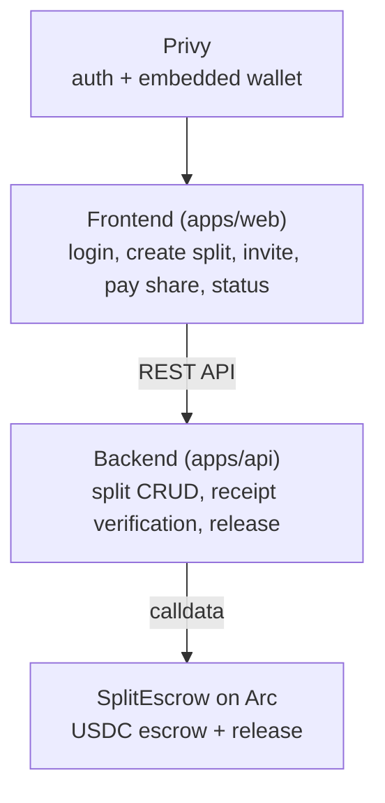

# SplitHappens

Split shared expenses with friends: no seed phrases, no bank transfers, no
"I'll pay you back next week". Log in with email, create a split, and each
person pays their share in USDC from a Privy embedded wallet. Funds sit in an
on-chain escrow on Arc, and are released to the payee **only once every share
is collected**.

## How it works

1. **Log in with email.** Privy creates an embedded wallet for you. No seed
   phrase is ever shown.
2. **Fund your wallet.** Grab testnet USDC from the faucet linked in the app.
   See [Funding your wallet](#funding-your-wallet).
3. **Create a split.** Name it, set the total, pick the payee wallet and how
   many people are splitting (including you). Everyone pays an equal share.
   Your own wallet signs `openSplit`, so a real escrow exists before anyone
   pays; gas comes from your USDC, and the backend holds no keys.
4. **Invite people.** Each friend is matched by the email on their account, so
   the split shows up for them without needing a link.
5. **Pay your share.** One click approves the escrow and deposits your USDC on
   Arc testnet.
6. **Release.** The contract holds the funds until the target is met. Once the
   pool is fully collected, a participant triggers `release()` and the full
   balance goes to the payee. No one holds the money in between; the escrow is
   the source of truth.

## Features

- Privy email login with an auto-created embedded wallet (no seed phrase)
- QR code scan to fill the payee address when creating a split
- Split creation with a title, total amount, and equal shares per participant
- Invite participants by email, claimed when that email logs in
- On-chain escrow on Arc that releases to the payee once fully funded
- Responsive layout that works across desktop and mobile

## Funding your wallet

> **Fiat on-ramp is deliberately not implemented.** Funding is handled with the
> [Circle faucet](https://faucet.circle.com/).

### Why not a fiat on-ramp?

Privy supports card and bank on-ramps (`useFiatOnramp`, `useAddFunds`) that
convert fiat straight into a wallet. They don't work for this app:

- On-ramp providers deliver to a **fixed set of destination chains** (Base,
  Ethereum, Arbitrum, Polygon, Solana, Tempo). **Arc is not one of them.**
- Stripe's onramp **does not support testnets**, and SplitHappens settles on Arc
  **testnet**.
- Bridging from a supported chain to Arc (CCTP) is an explicit **non-goal** in
  the product requirements.

So a fiat on-ramp would need an on-ramp plus bridge hop that the project scopes
out. On a testnet, the faucet is the funding rail.

### What the app does instead

- A faucet shortcut copies your wallet address and opens `faucet.circle.com` in
  a new tab, so you can top up without leaving the flow.
- `/profile` renders your wallet address as a QR code, so someone else can send
  testnet USDC directly.

## Why it's built this way

| Problem | Approach |
|---|---|
| Seed phrases scare off non-crypto users | Privy embedded wallets: email login, wallet in the background |
| Group payments need trust | Escrow holds funds until the target is met (conditional, multi-step settlement) |
| Paying someone back is manual | USDC on Arc testnet: cheap, fast, settled on-chain |
| Verified humans only (stretch) |  |

### How Privy is used

- **Client (`apps/web`)**: `@privy-io/react-auth` for email login, embedded
  wallet creation, and signing the USDC approve and deposit transactions.
- **Server (`apps/api`)**: `@privy-io/server-auth` verifies every request's
  Privy JWT and maps the verified identity to a local user row.

### How Arc / USDC is used

- All settlement is **USDC on Arc testnet** (chain id `5042002`), where USDC is
  also the gas asset.
- The escrow contract (`SplitEscrow`) holds USDC per split and pays the payee
  the full balance once `collected >= target`, a conditional settlement flow
  rather than a plain transfer.
- The backend verifies the `openSplit` and `deposit` transactions from their
  **receipts** instead of trusting the client's claim.

## Architecture

## Stack

- **Wallet / auth:** Privy (`@privy-io/react-auth`, `@privy-io/server-auth`)
- **Chain:** Arc testnet via viem; USDC settlement
- **Escrow:** Solidity `SplitEscrow` contract (Hardhat)
- **API:** Node + Express + Prisma (Postgres), Zod for validation
- **Web:** React + Vite (plain JSX), react-router, anime.js

## Known gaps

- **No fiat on-ramp.** Intentional; funding is faucet-based. See
  [Funding your wallet](#funding-your-wallet).
- **Testnet only.** No mainnet deployment, bridging, or recurring splits. These
  are explicit non-goals.
